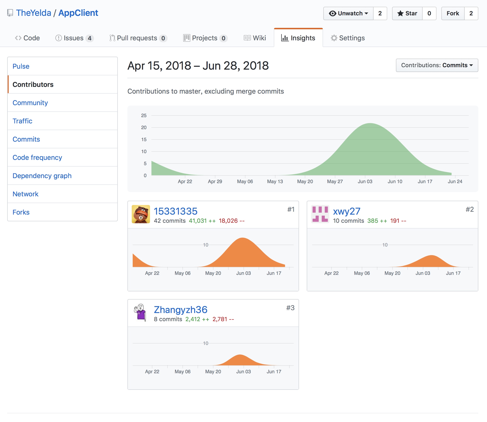

# 个人报告

`15331335`

## 自我总结

在项目中我主要完成了大部分的前端设计与开发工作。

### 关于项目

- 分析：这个项目有实际的应用背景与明确的产品定位，却在项目前期缺少有效的需求分析工作，导致项目迭代中经常出现用户需求不明以及缺漏的情况。
- 设计：由于急于求成，我没有很好地与团队沟通，并受限于个人的开发经验以及对框架机制的理解，使得架构设计过于粗糙，导致在开发后期频繁出现漏洞。
- 开发：通过不断地摸索与模仿最佳实践，我基本掌握了使用 vue 框架完成整个项目的能力。
- 管理：未能很好估计自己的工作量，拖延了项目进度导致项目管理出现困难。

### 致谢

- 感谢项目负责人 [@ZexinYan](https://github.com/ZexinYan) 在代码优化方面提供的建议与帮助，以及开发工作中的跟进与督促；
- 感谢后端成员 [@Ace-0](https://github.com/Ace-0) 在开发过程中的协助与测试，帮助完善系统的开发；
- 感谢前端成员 [@xwy27](https://github.com/xwy27) 与 [@Zhangyzh36](https://github.com/Zhangyzh36) 一起完成开发工作以及后端成员 [@controny](https://github.com/controny) 的帮助。

## PSP 2.1 统计表

| PSP2.1                                  | 预估耗时（小时） | 实际耗时（小时） |
| --------------------------------------- | ---------------- | ---------------- |
| **Planning**                            |                  |                  |
| - Estimate                              | 0.5              | 0.1              |
| **Development**                         |                  |                  |
| - Analysis                              | 1                | 2                |
| - Design Spec                           | 1                | 0.5              |
| - Design Review                         | 1                | 1                |
| - Coding Standard                       | 2                | 3                |
| - Design                                | 1                | 3                |
| - Coding                                | 5 * 24           | 7 * 24           |
| - Code Review                           | 2                | 1                |
| - Test                                  | 5                | 10               |
| **Reporting**                           |                  |                  |
| - Test Report                           | 1                | 0.5              |
| - Size Measurement                      | 0.5              | 0.5              |
| - Postmortem & Process Improvement Plan | 1                | 0.5              |

## 统计报告

## 工作清单

- 前端架构与实现：确定了技术栈，并完成了绝大部分的编码工作。

## 博客清单

- [项目复盘与经验教训](https://github.com/15331335/SSAD/blob/master/report.md)

