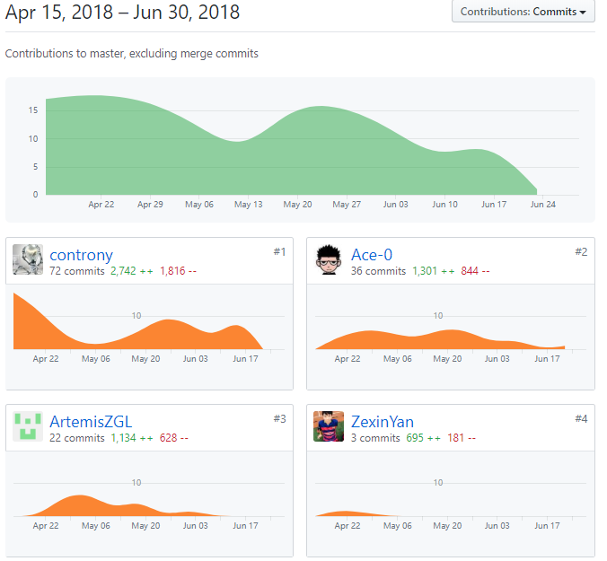

# 个人报告

>15331350[@controny](https://github.com/controny)

## 自我总结

我在项目中主要负责后端的实现，参与了后端项目框架的设计和代码的编写，同时因为有一位学弟也始终在参与我们项目的后端开发，所以我也承担了一定的管理工作（虽然只是对一个人的管理）。

后端的开发过程总体上并没有太多的问题，我认识到，为了提高编码的效率，把编程题变成填空题是一件很重要的事情。于是，我们一开始就确立了一个可维护性尚可的代码架构，同时注意代码风格的统一，这样一来，当我把代码的骨架都写好了以后，尽管学弟并没有太多的开发经验，但还是出色地完成了我交给他的任务。另外，后端虽然是离客户比较远的，但理解项目的需求对开发同样非常重要，因为我们编写的是业务逻辑的代码，写代码时，脑中浮现更多的不是数据结构，而是实现需求的过程。

最后实在要感谢学弟[@ArtemisZGL](https://github.com/ArtemisZGL)对项目的贡献，尽管这不是他的课程作业，但他对项目的开发怀有很高的热情，始终按时完成任务。

## PSP 2.1 统计表
| PSP2.1                                  | 预估耗时（小时） | 实际耗时（小时） |
| --------------------------------------- | ---------------- | ---------------- |
| **Planning**                            |                  |                  |
| - Estimate                              | 0.5              | 0.5              |
| **Development**                         |                  |                  |
| - Analysis                              | 1                | 2                |
| - Design Spec                           | 1                | 3                |
| - Design Review                         | 1                | 2                |
| - Coding Standard                       | 1                | 1                |
| - Design                                | 1                | 3                |
| - Coding                                | 5 * 24           | 7 * 24           |
| - Code Review                           | 2                | 1                |
| - Test                                  | 5                | 10               |
| **Reporting**                           |                  |                  |
| - Test Report                           | 1                | 0.5              |
| - Size Measurement                      | 0.5              | 0.5              |
| - Postmortem & Process Improvement Plan | 1                | 0.5              |

## 统计报告

## 工作清单

- 后端架构设计与代码编写
- 参与需求分析

## 博客清单

- [关于Web服务器、Web框架和WSGI的理解](https://controny.github.io/2018/04/15/web-server-web-app-and-wsgi/)
