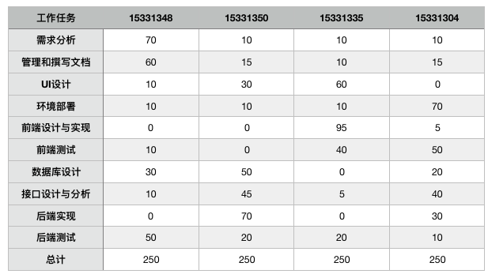
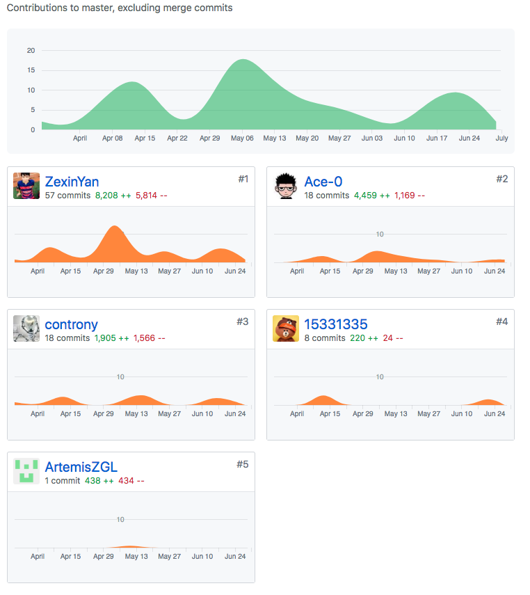
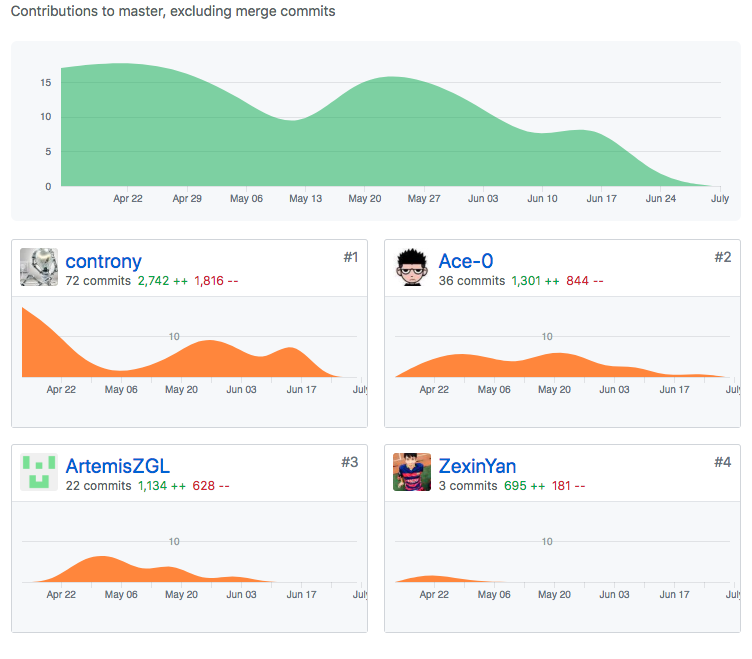
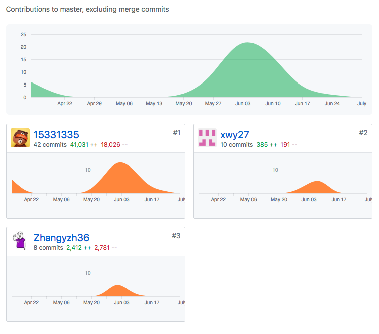
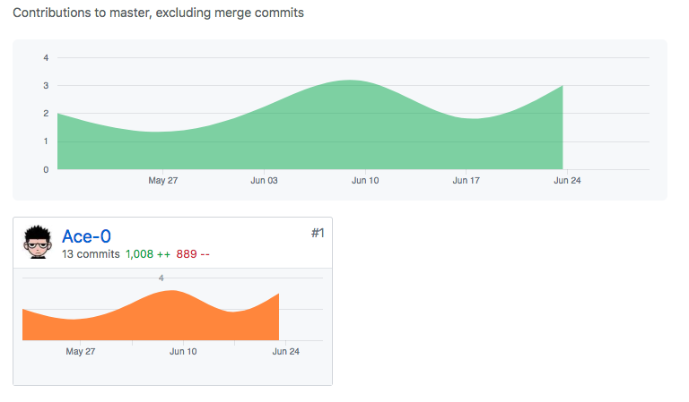

# Team Profile
* 团队名称：Yelda/眼底图像智能标注系统
* 团队目标：构建最好的眼底图像系统并最终实现自动分级标注。
* 团队成员清单：

| 学号 | 姓名 | 英文名 | 专业方向 | 职务 |
| --- | --- | --- | --- | --- |
| 15331348 | 颜_Stary | Stary | 技术/客户 | 项目经理、工程师 |
| 15331335 | 徐_Haiyang | Haiyang Xu | 技术/客户 | 项目经理、工程师 |
| 15331304 | 王_Ace | Ace | 技术 | 工程师、测试工程师 |
| 15331350 | 杨_Dimitri | Dimitri | 技术 | 工程师 |
| 16340295 | 张_Yanze | Yanze Zhang | 技术 | 工程师 |
| 16340304 | 郑_Guolin | Guolin Zheng | 技术 | 工程师 |

* 具体分工与个人宣言

| 姓名 | 分工内容 | 个人宣言 |
| --- | --- | --- |
| Stary | 负责项目总体规划和具体分工、负责项目后端数据库技术开发 | I CAN DO ALL THINGS. |
| Haiyang Xu | 负责项目前期需求调查分析与整理细化、设计UI界面、负责前端开发 | 队友个个都是人才，我超喜欢这里的！ |
| Ace | 负责项目后端开发、搭建文件服务器、负责API接口设计、项目部署 | 投身项目，发家致富 |
| Dimitri | 负责项目后端开发、负责编写测试案例、负责项目总体开发维护和技术支持 | NULL |
| Yanze Zhang | 负责项目前端开发 |  |
| Guolin Zheng | 负责项目前端开发 | 睡觉是不可能睡觉的，这辈子不可能睡觉的 |

[Tower](https://tower.im/projects/8808e1e72cbe4492b1d6af0a2df4208e/)

## Contribution

