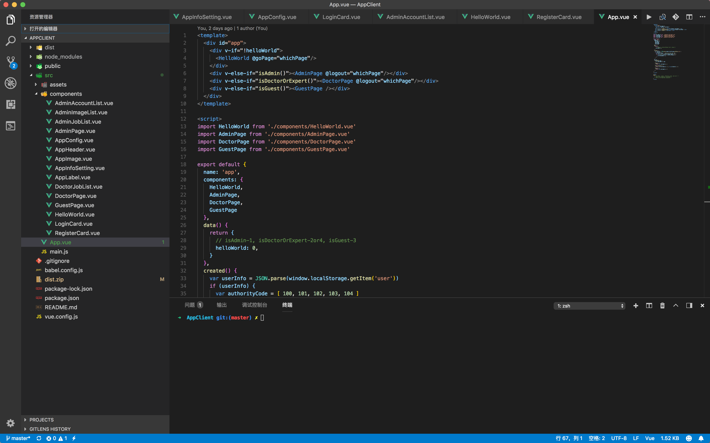
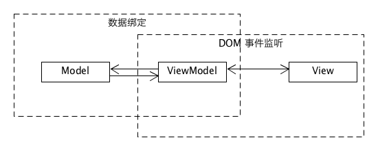

## 逻辑架构到应用程序映射指南

> 下面以项目的前端部分为例，来解释框架目录设计与逻辑架构与 ECB 的关系。

**框架目录及其架构图**

**架构设计**

不同架构和框架映射机制不一样。相比起传统的 MVC 架构，Vue 是一个 MVVM 架构。

MVVM 是 **Model-View-ViewModel** 的简写，即模型-视图-视图模型。

- 模型：指的是后端传递的数据。
- 视图：指的是所看到的页面。
- 视图模型：mvvm模式的核心，它是连接view和model的桥梁。

根据 Vue 官方网站的介绍：

> Vue (读音 /vjuː/，类似于 **view**) 是一套用于构建用户界面的**渐进式框架**。与其它大型框架不同的是，Vue 被设计为可以自底向上逐层应用。**Vue 的核心库只关注视图层**，不仅易于上手，还便于与第三方库或既有项目整合。另一方面，当与现代化的工具链以及各种支持类库结合使用时，Vue 也完全能够为复杂的单页应用提供驱动。

从目录中的 Components 来看，Vue 组件化的优势在于高效地组织了前端的 HTML、CSS 以及 JavaScript 代码。**而与 ECB 模型的映射关系很难从目录中直接看出，因为采用组件化构建的项目是以组件为单位，单个组件其实就是一个小的 MVVM 架构。**

