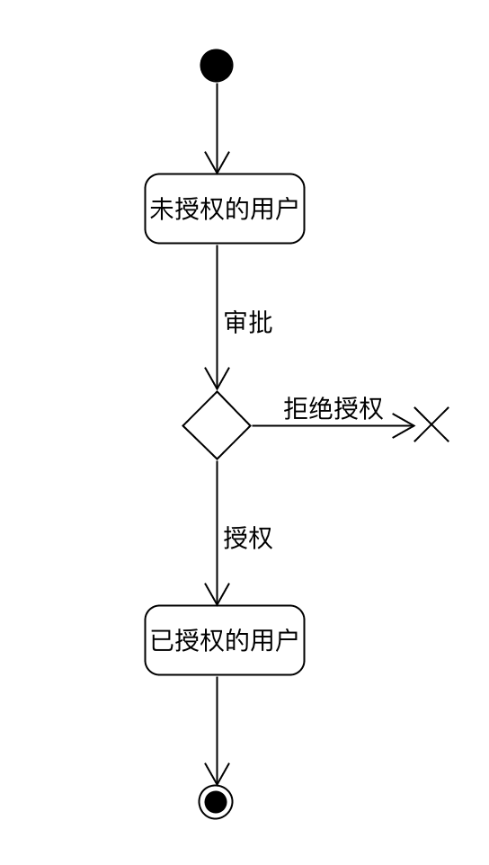
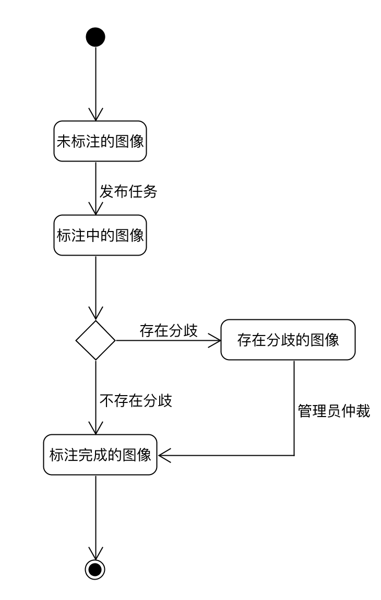

# State Model

## 登录注册状态模型

建模理由：该系统是医院内部系统，所有的用户创建都是需要进过审核才能进入系统内进行操作的，由此来保证系统内部信息安全性。另外，我们也在一定程序上允许外部人员进系统内进行“参观”，但同样地需要进过管理员审核才能完成注册。

## 分配任务状态模型

## 图片状态模型

建模理由：本系统为图片标注系统，因此图片是最基本的单位。对于一张图片需要进过至少两位医生分析诊断才能得出最终结果，一旦两位医生的诊断结果有差异就交由管理员进行最终仲裁。

