# 测试设计文档

## 阅读说明

1. 本文档根据API接口设计了一系列场景用于进行黑盒测试。
2. 图中所示的Fail/Succeed为预期结果。
3. 本文档也可以用于理解业务逻辑。

## Oneself
验证是否可以获取个人ID。

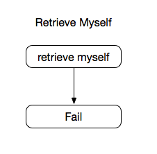

## Authorization
验证是否登录成功。

### Create Authorization

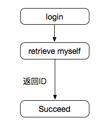

### Remove Authorization

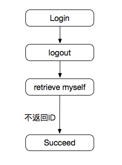

## Accounts

### Retrieve Account

### Edit Account

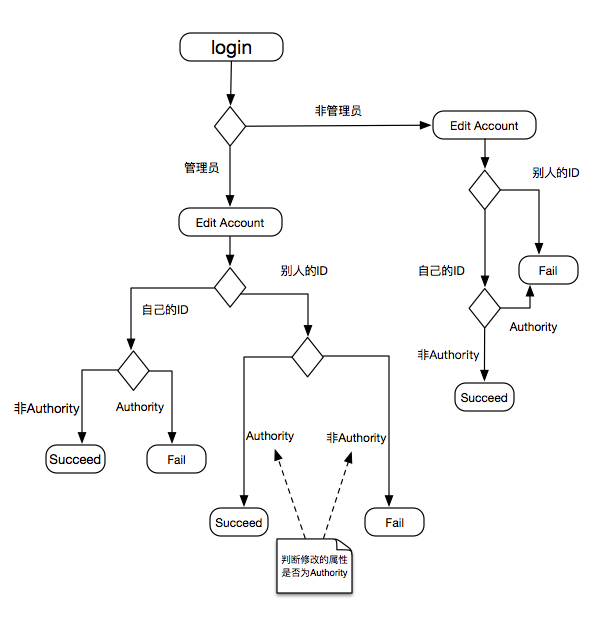

### Delete Account

### List Accounts

### Create Accounts
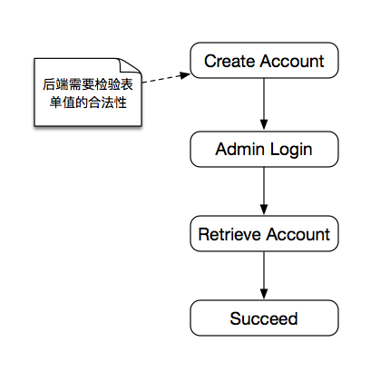

## Job
### Retrieve a single job

### edit a job
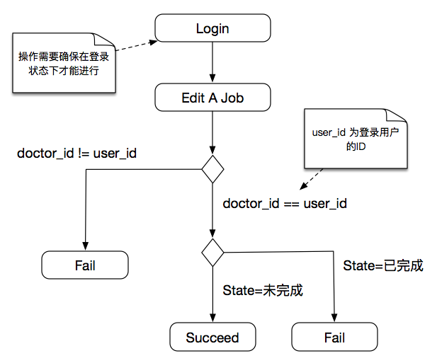

### delete a job
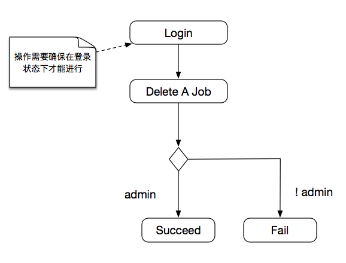

### list all jobs
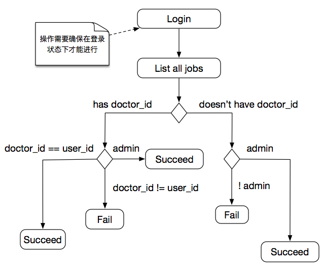

### create a job
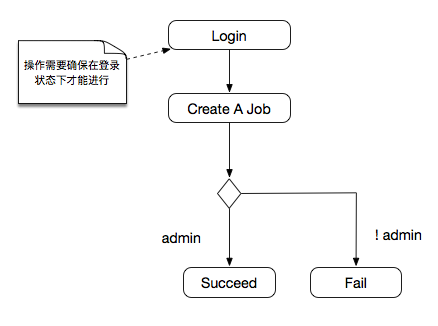

## Images
### Retrieve A single image

### edit an image
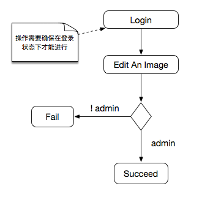

### delete an image

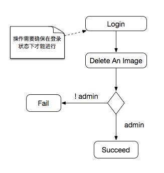

### List All images
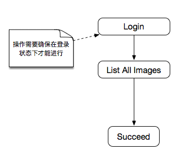

### create an image

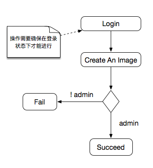

## Label

### retrieve a label

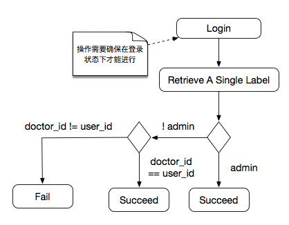

### edit a label

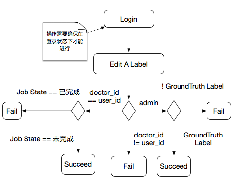

### delete a label

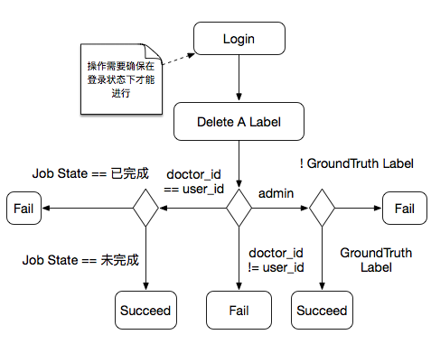

### create a label

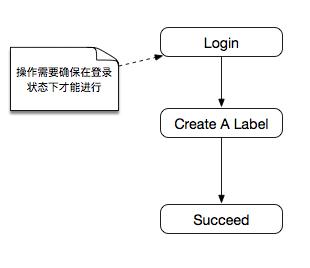

