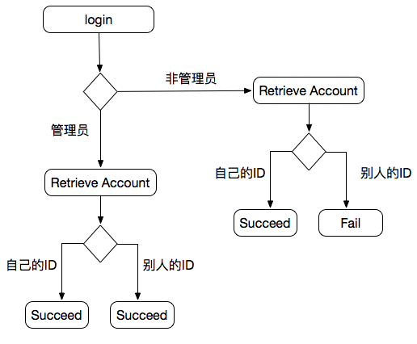
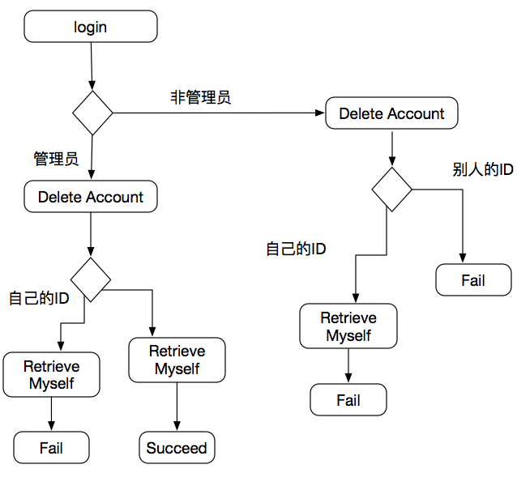
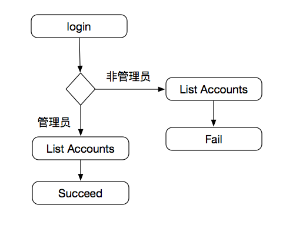

# 测试设计文档

## 阅读说明

1. 本文档根据API接口设计了一系列场景用于进行黑盒测试。
2. 图中所示的Fail/Succeed为预期结果。
3. 本文档也可以用于理解业务逻辑。

## Oneself
验证是否可以获取个人ID。

## Authorization
验证是否登录成功。

### Create Authorization

### Remove Authorization

## Accounts

### Retrieve Account

### Edit Account

### Delete Account

### List Accounts

### Create Accounts

